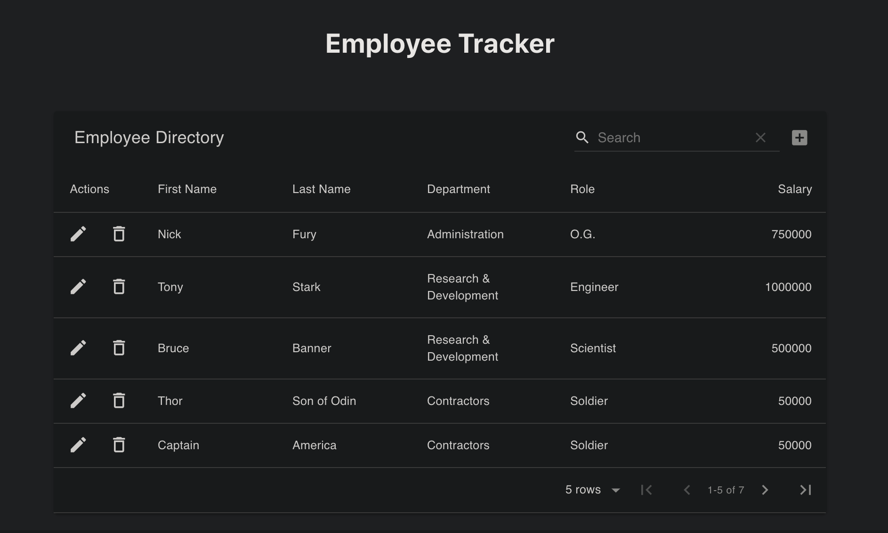

# React--Employee-Tracker

```sh
An employee directory using React.
This application is broken into UI components, which:
Manage components state, by responding to user events.
```

#### [View React Employee Tracker Here!](https://react--employee-tracker.herokuapp.com/)

#### Page Preview:



#### Technologies:

```sh
* JavaScript
* Node.JS
* material-table
* Heroku
```
